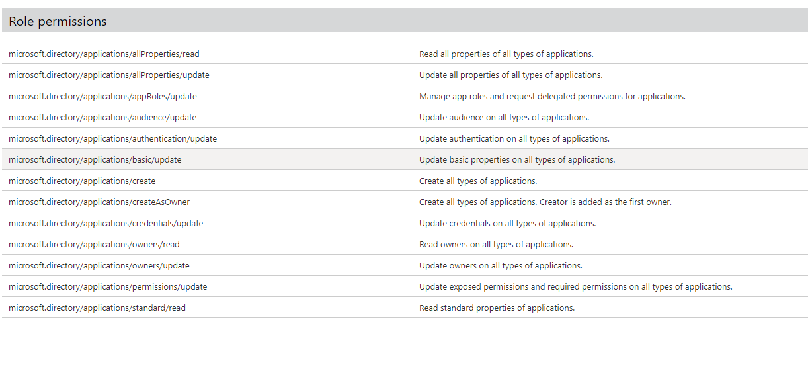
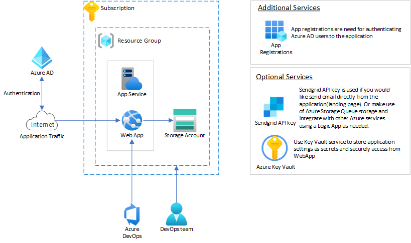

## There are three options to quickly deploy this code in your azure account.

### Option 1
Please use this option, if you already have app registrations created and would like to create an App Service, Storage account and Deploy the code to App Service.

[](https://portal.azure.com/#create/Microsoft.Template/uri/https%3A%2F%2Fraw.githubusercontent.com%2Fsanthoshb-msft%2FCommercial-Marketplace-SaaS-Manual-On-Boarding%2Fmain%2Fresources%2Fdeploy%2FmainTemplate.json)


### Option 2
Please use this option, to Create App registrations using the Powershell script, App Service, Storage account with ARM template and Deploy the code to App Service.

```powershell
md landinpageappdeploy #create a staging directory

cd landinpageappdeploy #go to the new staging directory

curl -o deploy.ps1 https://raw.githubusercontent.com/santhoshbomma9/landingpage-deploy-automation/main/deploy.ps1  # pull deploy ps file

curl -o mainTemplate.json https://raw.githubusercontent.com/santhoshbomma9/landingpage-deploy-automation/main/mainTemplate.json  # pull template json file

Connect-AzureAD #connect to you azure account

.\deploy.ps1 #run the deploy file
```

### Option 3

Please use this option, if you like to Create App registrations, App and Storage account using ARM template and Deploy the code to App Service. 

This option will require a User Managed Identity with the right AzureAD roles permissions.

[Creating a User Managed Identity](https://docs.microsoft.com/en-us/azure/active-directory/managed-identities-azure-resources/how-to-manage-ua-identity-portal)

Required permissions below:

Pass this User Managed Identity Resource ID to the below ARM template deployment

[](https://portal.azure.com/#create/Microsoft.Template/uri/https%3A%2F%2Fraw.githubusercontent.com%2Fsanthoshb-msft%2FCommercial-Marketplace-SaaS-Manual-On-Boarding%2Fmain%2Fresources%2Fdeploy%2Fazuredeploy.json)  

---


### Sample Architecture
Below sample architecture could be one way of running the sample app in your Azure instance in a Cloud optimized way.



</hr>
